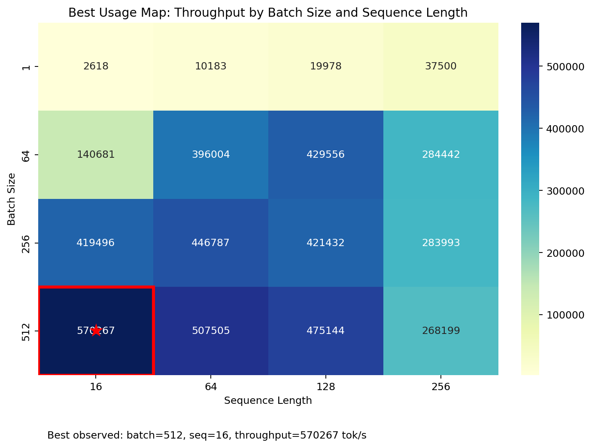
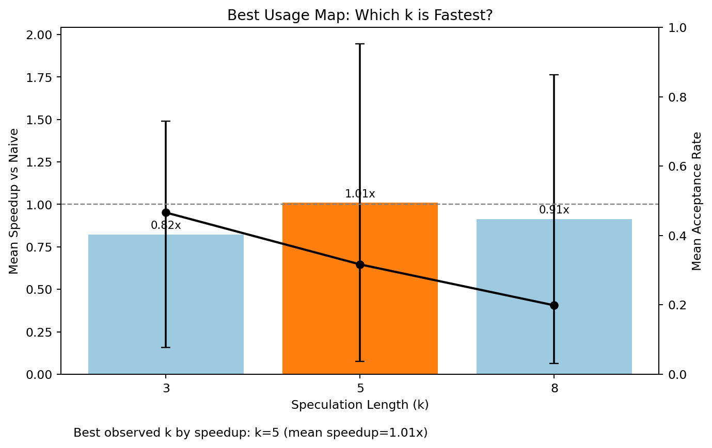
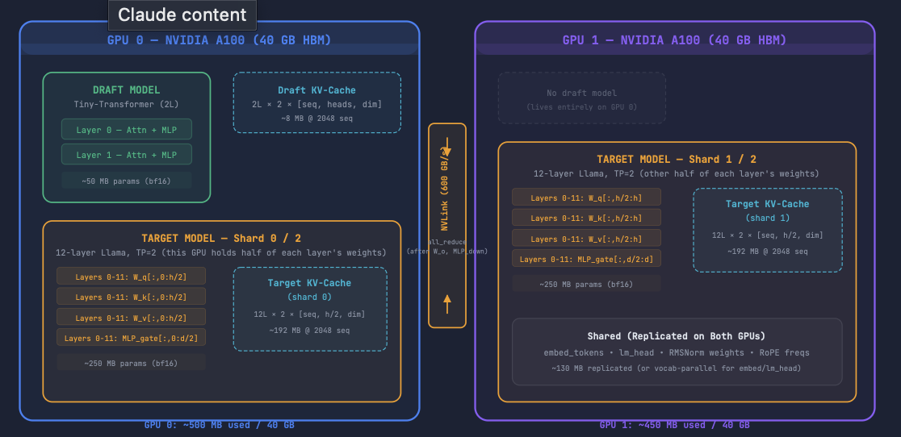
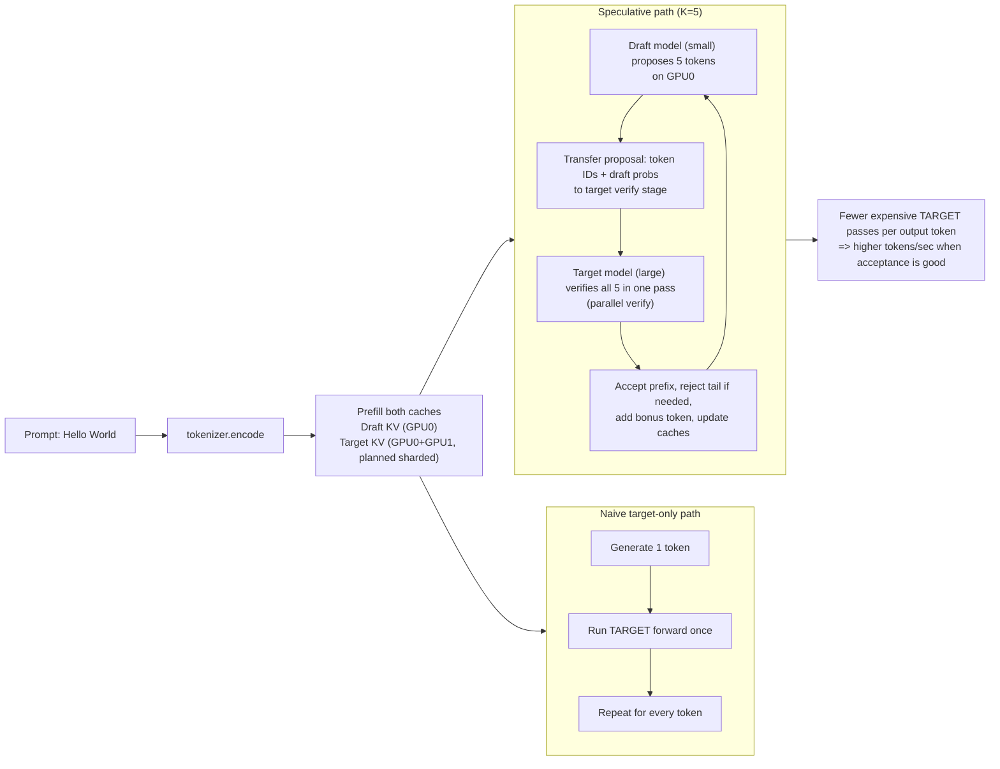

# XLA-Sharded

Built a JAX/Flax NNX inference system with static KV-cache, XLA decode loops, speculative draft/target verification, and tensor-parallel sharding utilities.


## What It Does

- Llama-style transformer implementation in Flax NNX (RoPE, RMSNorm, GQA, SwiGLU)
- Static KV-cache that works with JIT and loop-based generation
- Three decode paths: `naive`, `xla`, `speculative`
- Sharding helpers (`Mesh`, `NamedSharding`, `PartitionSpec`)
- Benchmark/report modules for throughput and acceptance metrics

## Best Usage Maps

### 1) Batch/Sequence Best Usage



Short discussion:
- In this benchmark, larger batch sizes gave much higher throughput because fixed compute/dispatch overhead is amortized across more tokens.
- Sequence length helps until memory/compute pressure dominates; the best observed point in this run was `batch=512, seq=16`.
- This is why the “best cell” is at high batch with moderate/short sequence for the tested setup.

### 2) Best `k` for Speculative Speed



Short discussion:
- `k` controls proposal length: too small underuses speculative verification, too large increases rejection/rollback overhead.
- In the recorded experiment, `k=5` gave the best average speedup overall.
- The optimal `k` depends on draft-target alignment (acceptance rate): better alignment tolerates larger `k`; poorer alignment favors smaller `k`.

## Design Structure (Plan + Code)

```text
xla-sharded/
├── pyproject.toml
├── README.md
├── demo.py
│
configs/
│   └── model_config.py           # Target + draft configs
│
models/
│   ├── layers.py                 # RMSNorm/RoPE/GQA/SwiGLU/block
│   ├── transformer.py            # Main transformer
│   ├── draft_model.py            # Draft model factory
│   └── kv_cache.py               # Static KV cache
│
engine/
│   ├── generate_naive.py         # Python loop + jitted step
│   ├── generate_xla.py           # jax.lax.while_loop decode
│   ├── spec_dec.py               # Draft/target speculative decode
│   └── sharder.py                # Mesh/sharding helpers
│
benchmark/
│   ├── throughput.py             # Benchmark harness
│   ├── report.py                 # Report formatter
│   └── profiler.py               # Optional trace helper
│
tests/
│   ├── test_model.py
│   ├── test_generation.py
│   ├── test_kv_cache.py
│   ├── test_sharding.py
│   └── test_spec_dec.py
└── tokenizer/
    └── tokenizer.py
```

## Architecture Visual




## How It Works

1. Prompt is tokenized by `DummyTokenizer`.
2. Target model prefills KV-cache with prompt context.
3. Selected generation path runs:
- `naive`: Python loop calls a jitted single-token step.
- `xla`: decode loop is compiled into `jax.lax.while_loop`.
- `speculative`: draft proposes `k` tokens, target verifies/accepts/rejects, then rolls forward.
4. Output token IDs are decoded as bracketed IDs (`[123]`), since defaults use random weights and dummy tokenization.

## End-to-End Plot (How Draft Speeds Up Target)



Speedup intuition from the plan:
- Target model is the expensive model.
- Without speculation, target runs once per token.
- With speculation, draft proposes `K` tokens and target verifies in bulk, reducing how often the expensive target path runs per emitted token.

## Installation

```bash
pip install -e .
pip install -e ".[dev]"
```

## Run

```bash
python demo.py --mode naive --prompt "The meaning" --max-tokens 50
python demo.py --mode xla --prompt "The meaning" --max-tokens 50
python demo.py --mode speculative --prompt "The meaning" --max-tokens 50 --k 5
python demo.py --mode compare --prompt "The meaning" --max-tokens 50 --warmup 1 --runs 3
```

## Test

```bash
pytest -q
```

## Notes

- Default weights are random initialization, so decoded outputs are token IDs rather than meaningful text.
- `DummyTokenizer` is intentionally simple for pipeline validation.
- Sharding tests are skipped automatically when fewer than 2 JAX devices are available.
