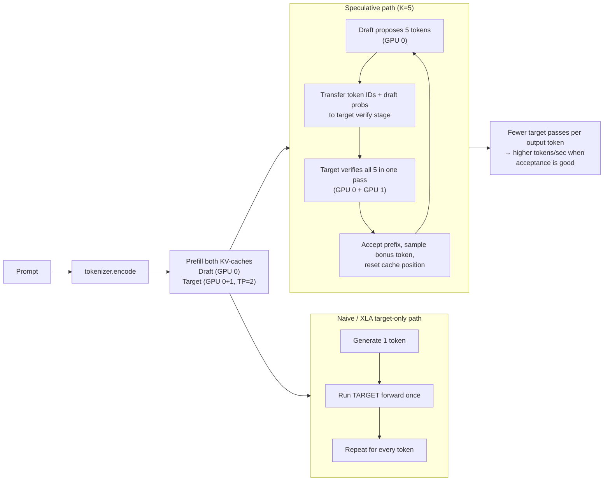

# XLA-Sharded

A multi-GPU speculative inference engine built with JAX, Flax NNX, and XLA. Demonstrates coordination of two independently compiled XLA computation graphs — a small draft model and a large target model — for speculative decoding across 2 GPUs.

---

## What It Does

- **Llama-style transformer** in Flax NNX: RoPE, RMSNorm, GQA (grouped-query attention), SwiGLU
- **Static KV-cache** compatible with `jax.jit` and XLA loop-based generation
- **Three decode paths**: `naive` (Python loop), `xla` (`jax.lax.while_loop`), `speculative` (draft + target)
- **Tensor-parallel sharding** across 2 GPUs via `Mesh` / `NamedSharding` / `PartitionSpec`
- **Benchmark harness** reporting tokens/sec, TTFT, and speculative acceptance rate

---

## How It Works

### Speculative Decoding Overview

```
XLA Graph #1 — Draft Model (GPU 0 only, unsharded)
  2-layer Tiny-Transformer, ~25M params
  Generates K=5 candidate tokens autoregressively
          │
          │  draft_tokens[0..5], draft_probs[0..5]
          ▼
XLA Graph #2 — Target Model (GPU 0 + GPU 1, tensor-parallel)
  12-layer Llama-style, ~125M params
  Verifies all 5 draft tokens in ONE forward pass
          │
          ▼
  Rejection sampling → accept n ≤ 5 → rollback caches → repeat
```

**Why it's faster:** Without speculation, the expensive target model runs once per output token. With speculation, the draft proposes K tokens and the target verifies them in bulk — when acceptance is high, the target runs once per ~K tokens.

### End-to-End Flow



### Speculative Decode Protocol

1. Prefill both KV-caches with the prompt.
2. Draft generates K=5 tokens via autoregressive steps.
3. Target verifies all K tokens in a single forward pass.
4. Rejection sampling (vectorized):
   ```
   accept_prob = min(target_prob / draft_prob, 1.0)
   n_accepted  = cumsum(uniform < accept_prob).sum()
   ```
5. Cache position reset to `n_accepted`; one bonus token sampled from the adjusted distribution.
6. Repeat until EOS or `max_tokens`.

### Sharding Strategy (Tensor Parallelism, TP=2)

```python
mesh = Mesh(devices[:2], axis_names=("model",))
```

| Weight | PartitionSpec | Effect |
|--------|--------------|--------|
| `W_q, W_k, W_v` | `P(None, "model")` | Split heads across GPUs |
| `W_o, W_down` | `P("model", None)` | Gather (implicit all-reduce) |
| `W_gate, W_up` | `P(None, "model")` | Split MLP intermediate dim |
| `embed_tokens` | `P("model", None)` | Vocab-parallel |
| `lm_head` | `P(None, "model")` | Split logit computation |
| RMSNorm, RoPE | `P()` | Replicated |
| KV-cache (heads dim) | `P(None, None, None, None, "model", None)` | Matches `W_k/W_v` sharding |

Draft model: `SingleDeviceSharding(devices[0])` — all weights on GPU 0.

---

## Architecture

```
xla-sharded/
├── demo.py                        # CLI entry point (typer)
├── configs/
│   └── model_config.py            # ModelConfig (12L) + DraftConfig (2L) dataclasses
├── models/
│   ├── layers.py                  # RMSNorm, RoPE, GQAAttention, SwiGLU, TransformerBlock
│   ├── transformer.py             # Shared Transformer module (Flax NNX)
│   ├── draft_model.py             # Draft model factory
│   └── kv_cache.py                # Static pre-allocated KV-cache (JAX pytree)
├── engine/
│   ├── sharder.py                 # Mesh, NamedSharding, weight placement helpers
│   ├── generate_naive.py          # Baseline: Python loop + jitted step
│   ├── generate_xla.py            # Optimized: jax.lax.while_loop
│   └── spec_dec.py                # Draft → Verify → Accept/Reject orchestrator
├── benchmark/
│   ├── throughput.py              # Timing harness (warmup + block_until_ready)
│   ├── report.py                  # Rich-formatted terminal table
│   └── profiler.py                # jax.profiler trace helper (optional)
├── tokenizer/
│   └── tokenizer.py               # DummyTokenizer (V1) / GemmaTokenizer (V2)
└── tests/
    ├── test_model.py
    ├── test_sharding.py
    ├── test_kv_cache.py
    ├── test_spec_dec.py
    └── test_generation.py
```

**Separation of concerns:**
- `models/` — pure Flax NNX modules, no sharding or generation logic
- `engine/` — sharding, device placement, generation loops
- `benchmark/` — profiling and reporting only (never imported by engine or models)

### Architecture Diagram


---

## Benchmarks

### Batch × Sequence Length Throughput


Larger batch sizes amortize fixed dispatch overhead, giving much higher throughput. The best observed configuration was `batch=512, seq=16` — high batch with moderate sequence length.

### Optimal Speculation Length (k)


`k` controls how many tokens the draft proposes per round. Too small underuses the bulk verification; too large increases rejection/rollback overhead. `k=5` gave the best average speedup. Optimal `k` scales with draft–target alignment: higher acceptance rate tolerates larger `k`.

---

## Installation

```bash
pip install -e .
pip install -e ".[dev]"      # include pytest
pip install -e ".[gemma]"    # V2 Gemma SentencePiece tokenizer
pip install -e ".[profile]"  # TensorBoard XLA profiling
```

**Hardware:** 2× NVIDIA GPU with ≥8 GB VRAM (CUDA 12.x + cuDNN 9+).
**CPU fallback (development):** Simulates 2 devices on CPU — no GPU required.

```bash
XLA_FLAGS=--xla_force_host_platform_device_count=2 python demo.py --mode speculative
```

---

## Usage

```bash
# Single-mode runs
python demo.py --mode naive       --prompt "The meaning" --max-tokens 50
python demo.py --mode xla         --prompt "The meaning" --max-tokens 50
python demo.py --mode speculative --prompt "The meaning" --max-tokens 50 --k 5

# Compare all three modes with benchmark table
python demo.py --mode compare --prompt "The meaning" --max-tokens 200 --warmup 1 --runs 5

# Full options
python demo.py --help
```

**All CLI options:**

| Option | Default | Description |
|--------|---------|-------------|
| `--prompt` | `"The meaning"` | Input prompt |
| `--max-tokens` | `200` | Max new tokens to generate |
| `--mode` | `naive` | `naive` \| `xla` \| `speculative` \| `compare` |
| `--k` | `5` | Speculation length (speculative mode) |
| `--seed` | `42` | Model initialization seed |
| `--warmup` | `1` | Warmup runs before timing (compiles XLA graph) |
| `--runs` | `3` | Number of timed benchmark runs |
| `--tokenizer` | `dummy` | `dummy` (V1) \| `gemma` (V2 — requires `[gemma]` extra) |
| `--profile` | `false` | Enable XLA TensorBoard trace + HLO dump |
| `--profile-dir` | `/tmp/xla_trace` | Output directory for profile artefacts |

---

## Tests

```bash
pytest -q               # all tests
pytest tests/test_model.py -v   # single file
pytest -x tests/        # stop on first failure
```

Sharding tests are skipped automatically when fewer than 2 JAX devices are available.

---

## Tokenizer

### V1 — DummyTokenizer (default)

Maps each character to `ord(c) % vocab_size`. No real vocabulary; output is
`[123] [456]` placeholder tokens. Used for pipeline and sharding correctness
testing — no external downloads needed.

### V2 — Gemma SentencePiece tokenizer (optional)

Uses the Gemma model's SentencePiece vocabulary via HuggingFace `transformers`.

```bash
pip install -e ".[gemma]"
```

Before running, update **both** `ModelConfig` and `DraftConfig` in
`configs/model_config.py`:

```python
vocab_size: int = 256_000   # Gemma has 256 k tokens (was 32 000)
```

Then pass `--tokenizer gemma` on the CLI:

```bash
python demo.py --mode speculative --tokenizer gemma --prompt "The meaning of life"
```

> **Note:** Gemma weights are gated on HuggingFace Hub. Run
> `huggingface-cli login` and accept the model licence before first use.

---

## XLA Profiling (optional)

Install the profiling extras:

```bash
pip install -e ".[profile]"   # tensorboard + tensorboard-plugin-profile
```

### TensorBoard trace

```bash
python demo.py --mode xla --profile --profile-dir /tmp/xla_trace
tensorboard --logdir /tmp/xla_trace/trace
```

### Programmatic use

```python
from benchmark.profiler import trace_to, dump_hlo, profile_and_dump

# TensorBoard trace only
with trace_to("/tmp/xla_trace"):
    result = generate_xla(prompt)

# HLO IR dump only (no extra deps required)
with dump_hlo("/tmp/hlo_dump"):
    jax.jit(my_fn)(args)

# Both at once
with profile_and_dump("/tmp/run1") as dirs:
    result = speculative_decode(prompt)
# dirs == {"trace": "/tmp/run1/trace", "hlo": "/tmp/run1/hlo"}
```

`dump_hlo` writes `*.before_optimizations.txt` and `*.after_optimizations.txt`
files that show the XLA HLO IR before and after optimisation passes — useful
for understanding fusion, layout assignment, and sharding decisions.

---

## CI

A GitHub Actions workflow lives at `.github/workflows/ci.yml`.  It runs on
every push and pull request:

| Job | What it does |
|-----|-------------|
| `test` | Installs CPU-only JAX, sets `XLA_FLAGS=--xla_force_host_platform_device_count=2` to simulate 2 devices, and runs `pytest -q tests/` on Python 3.10 and 3.11. |
| `lint` | Runs `ruff check` for style errors. |

No GPU is required in CI — the same `XLA_FLAGS` trick used for local development
lets the full sharding and speculative-decode test suite pass on standard
hosted runners.

---

## Notes

- **Random weights:** Default initialization uses random weights, so decoded output is token IDs like `[123] [456]` rather than natural language. This is intentional — the goal is to validate the pipeline and sharding mechanics, not produce meaningful text.
- **DummyTokenizer:** Maps each character to `ord(c) % vocab_size`. For pipeline testing only.
- **Gemma tokenizer (optional):** See the [Tokenizer](#tokenizer) section above.
- **XLA profiling (optional):** See the [XLA Profiling](#xla-profiling-optional) section above.

---

## Optimization Notes

When tuning speculative decoding, work in this order:

1. Optimize the **target model path** first — it is the expensive baseline.
2. Measure the **speculative budget window**: how much draft + verify overhead still beats target-only decode.
3. Optimize the **draft model** to maximize acceptance rate within that budget.
4. Tune **`k`** jointly with draft quality (`k` too small wastes speculation; `k` too large amplifies rejections).
5. Add adaptive `k` and fallback logic once the above are stable.

**Core principle:** reduce effective target-model invocations per emitted token while keeping draft overhead below the speedup threshold.
